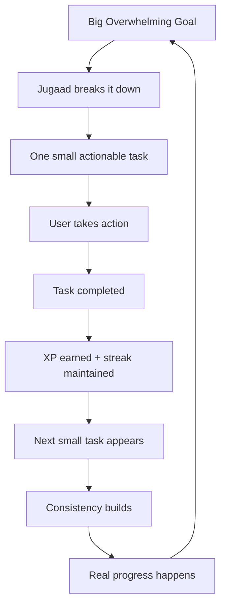
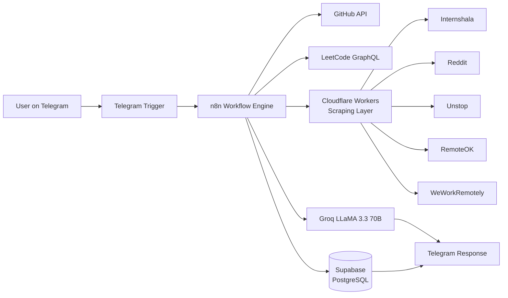
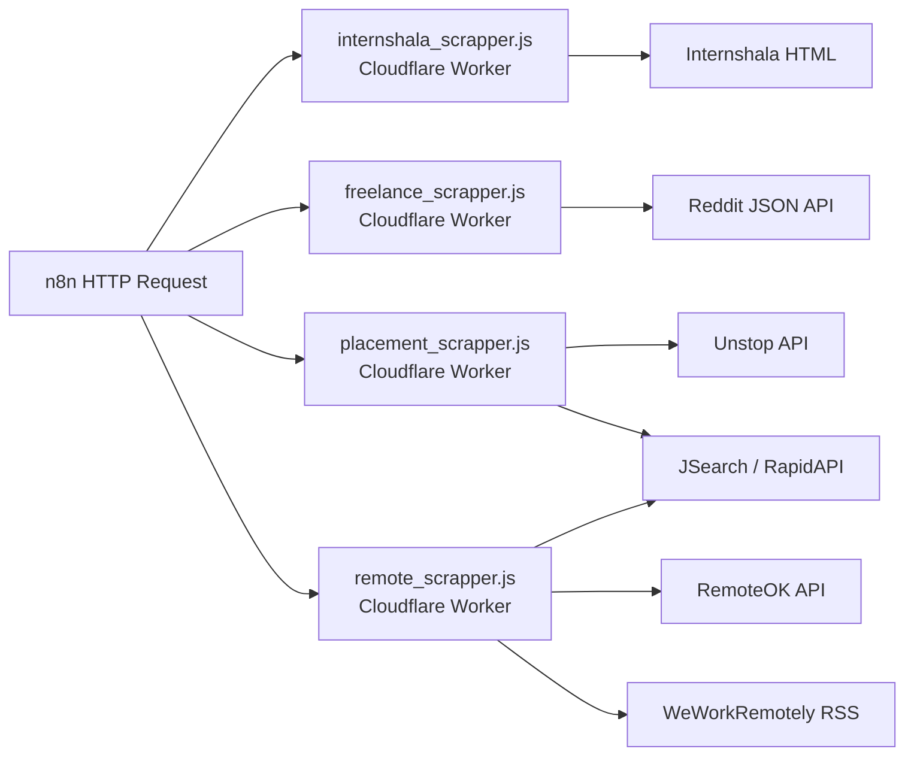
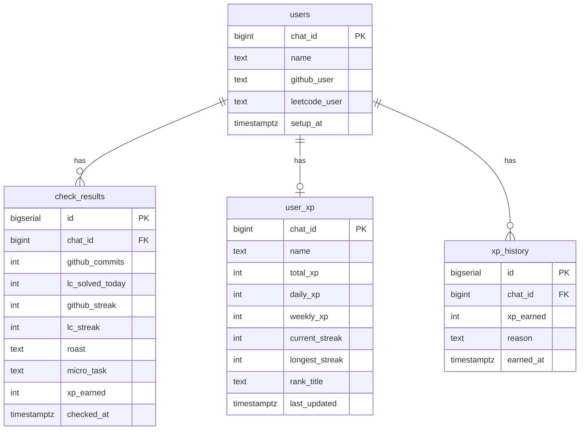

<p align="center">
  
</p>

<h1 align="center">Jugaad OS</h1>

<p align="center">
  <strong>Stop waiting. Start doing. One small step at a time.</strong>
</p>

<p align="center">
  
  
  
  
  
  
</p>

---

## What is Jugaad OS?

Jugaad OS is a **brutally honest, AI-powered productivity system** built for Indian college students and working professionals who know what they should be doing — but don't.

It runs entirely through **Telegram**, costs nothing to use, and works 24/7 without you having to open another app.

Every day it:

* Checks if you committed code or solved LeetCode problems
* Roasts you in Hinglish if you did nothing
* Sends you 45+ job opportunities every morning
* Tracks your XP and ranks you against other users
* Listens to your voice notes when you're anxious and responds with real comeback stories

The name **Jugaad** is deliberate. It means finding a simple, practical, creative solution to a problem. That's exactly what this is — a scrappy, effective system that meets you where you are.

---

## Why Jugaad OS?

### The Real Problem

Most productivity tools assume you're already motivated. They give you Kanban boards, habit trackers, and goal-setting frameworks.

But the actual problem is simpler and harder:

> You know what you should do. You just don't start.

"Prepare for placements" is too big. "Update my resume" feels overwhelming. "Learn DSA" sounds like a semester-long commitment.

So you open YouTube instead.

### The Jugaad Approach

Jugaad OS doesn't ask you to fix your entire life. It asks one question:

> **What's one useful thing you can do in the next 10 minutes?**

Instead of: *"Become placement ready"*
Jugaad says: *"Solve one easy LeetCode problem. Here's a good first issue on GitHub you can contribute to."*

Instead of: *"Build a project"*
Jugaad says: *"You haven't committed anything today. Your GitHub looks like a graveyard. Ek kaam kar — bas 10 minute."*

---

## The Jugaad Philosophy



Small tasks are not a compromise. They are the mechanism. Every big thing that has ever been built was built one small step at a time.

---

## Features

### Module 1 — Kal Kar Lunga Destructor 💀

The accountability engine. Your digital conscience.

| Feature                  | Description                                                        |
| ------------------------ | ------------------------------------------------------------------ |
| `/setup`                 | Register your GitHub and LeetCode usernames                        |
| `/check`                 | Instantly check today's activity + receive a Hinglish roast        |
| `/stats`                 | Full breakdown — commits, problems solved, streaks, global rank    |
| `/start`                 | Welcome and onboarding                                             |
| **Auto 10 PM check**     | Every night the bot checks what you did and roasts you accordingly |
| **Micro-task finder**    | Scrapes real "good first issue" GitHub problems for lazy days      |
| **Groq LLaMA roasts**    | Savage, personalised Hinglish commentary on your specific laziness |
| **Motivational stories** | Real comeback stories generated by LLM when you're struggling      |

### Module 2 — Paisa Jugaad 💰

Every morning at 8 AM IST, 45+ fresh opportunities are scraped and sent to your Telegram. All scraping is handled by four dedicated Cloudflare Workers (see [Scraper Details](#scraper-details) below).

| Source                              | What it scrapes                                     |
| ------------------------------------ | --------------------------------------------------- |
| Internshala                         | Paid internships (₹5,000+/month filter)             |
| Reddit r/forhire                    | Freelance gigs with budgets                         |
| Unstop + JSearch                    | Fresher placements from LinkedIn, Indeed, Glassdoor |
| RemoteOK + WeWorkRemotely + JSearch | Remote developer jobs worldwide                     |

### Module 3 — Anxiety to Action 🧠

Send a voice note or a text message when you're spiralling.

```text
"Yaar nahi hoga mujhse, sab log aage nikal rahe hain"
         ↓
Whisper transcribes your voice (Hindi/Hinglish)
         ↓
Groq detects the anxiety pattern
         ↓
BeautifulSoup scrapes real Reddit comeback stories
         ↓
Bot responds with:
  1. Empathy message
  2. Real story of someone who was in your exact position
  3. One specific action to take RIGHT NOW
  4. A roast to snap you out of the spiral 😂
```

### Module 5 — Life XP Gamification 🎮

Turn your daily grind into a game.

| Action                  | XP Earned           |
| ------------------------ | -------------------- |
| GitHub commit           | 30 XP per commit    |
| LeetCode problem solved | 50 XP per problem   |
| Active streak           | 20 XP bonus per day |

**Rank System:**

| XP Range      | Title                |
| -------------- | --------------------- |
| 0 – 99        | Naya Khiladi 🏏      |
| 100 – 299     | Gabbar ka Chamcha 😈 |
| 300 – 499     | Bumrah in Making 🎳  |
| 500 – 799     | Baazigar 🃏          |
| 800 – 1,199   | Virat Mode On 🔥     |
| 1,200 – 1,999 | Don ka Dost 👑       |
| 2,000 – 2,999 | Mogambo Khush Hua 😂 |
| 3,000+        | Don Hai Tu 🏆        |

Every Sunday at 8 AM IST, a full leaderboard with Groq-generated savage commentary is sent to all users.

---

## Scraper Details

All four scrapers are deployed independently as **Cloudflare Workers** and are called by n8n's HTTP Request nodes each morning at 8 AM IST. They're designed to fail gracefully — if a source is unreachable or its markup changes, each worker still returns a valid JSON payload (either with fewer results or a small default/fallback set) so the digest workflow never breaks.

| File                        | Deployed as                     | Sources scraped                                          | Notes                                                                 |
| ---------------------------- | -------------------------------- | ---------------------------------------------------------- | ---------------------------------------------------------------------- |
| `internshala_scrapper.js`   | `jugaad-internshaala-scraper`   | Internshala (`/internships/stipend-5000/`)                 | Regex-parses server-rendered HTML for title, company, stipend, location, duration, and link |
| `freelance_scrapper.js`     | `jugaad-freelance-scraper`      | Reddit r/forhire JSON API                                   | Filters for `[HIRING]` posts, extracts a budget from the title, and falls back to a default gig on error |
| `placement_scrapper.js`     | `jugaad-placement-scraper`      | Unstop public opportunity API + JSearch (RapidAPI)          | Combines Unstop fresher jobs with two JSearch queries (India fresher roles + entry-level remote roles) |
| `remote_scrapper.js`        | `jugaad-remote-scraper`         | RemoteOK API + JSearch (RapidAPI) + WeWorkRemotely RSS feed | Merges three sources into one list; RSS titles are split on `":"`/`" at "` to separate company from role |

> `placement_scrapper.js` and `remote_scrapper.js` both call the **JSearch** API via RapidAPI, so each of those two worker scripts needs its own `RAPIDAPI_KEY` set (see [Environment Variables](#environment-variables)).

---

## How It Works



---

## Technology Stack

| Layer           | Technology                              |
| ---------------- | ---------------------------------------- |
| Bot Interface   | Telegram Bot API                        |
| Workflow Engine | n8n (self-hosted)                       |
| LLM / AI        | Groq LLaMA 3.3 70B, OpenAI Whisper      |
| Scraping Layer  | Cloudflare Workers (JavaScript + Regex) |
| Python Scraping | BeautifulSoup (n8n Python Code nodes)   |
| Job Data API    | JSearch via RapidAPI                    |
| Database        | Supabase (PostgreSQL)                   |
| Scheduling      | n8n Schedule Trigger + cron             |
| Public Tunnel   | ngrok (development)                     |
| Hosting         | Railway / Render (production)           |

---

## Architecture

### Workflows

| Workflow | Trigger                       | Purpose                     |
| -------- | ------------------------------ | ----------------------------- |
| Module 1 | Telegram message + 10 PM cron | Activity tracking + roasts  |
| Module 2 | 8 AM IST daily                | Job opportunity digest      |
| Module 3 | Telegram voice/text           | Anxiety to action converter |
| Module 5 | 10 PM daily + Sunday 8 AM     | XP tracking + leaderboard   |

### Scraping Architecture



---

## Database Schema

### Supabase Tables



### Supabase Functions

| Function                                      | Purpose                                   |
| ----------------------------------------------- | -------------------------------------------- |
| `increment_xp(p_chat_id, p_daily_xp, p_name)` | Upserts XP, increments totals             |
| `update_rank(p_chat_id)`                      | Recalculates rank title based on total XP |
| `reset_weekly_xp()`                           | Resets weekly XP every Sunday             |

---

## Project Structure

```text
Jugaad OS/
├── n8n Workflows/
│   ├── Jugaad_OS_Module1.json       ← Activity tracking + commands
│   ├── Jugaad_OS_Module2.json       ← Daily job digest
│   ├── Jugaad_OS_Module3.json       ← Anxiety to action
│   └── Jugaad_OS_Module5.json       ← XP gamification
│
├── Cloudflare Workers/
│   ├── internshala_scrapper.js      ← Internshala internship scraper
│   ├── freelance_scrapper.js        ← Reddit r/forhire freelance gig scraper
│   ├── placement_scrapper.js        ← Unstop + JSearch placement scraper
│   └── remote_scrapper.js           ← RemoteOK + JSearch + WeWorkRemotely scraper
│
└── Supabase/
    ├── schema.sql                    ← All table definitions
    └── functions.sql                 ← increment_xp, update_rank, reset_rank
```

---

## Prerequisites

* **Node.js** v18+
* **n8n** installed globally via npm
* **ngrok** account (free tier) for webhook tunnelling
* **Telegram Bot** created via @BotFather
* **Supabase** project (free tier)
* **Groq API key**
* **Cloudflare account** for Workers
* **RapidAPI account** with JSearch subscribed

---

## Installation

### 1. Clone the repository

```bash
git clone https://github.com/A-K-SRIVASTAVA/jugaad-os.git
cd jugaad-os
```

### 2. Install and start n8n

```bash
npm install -g n8n
```

### 3. Start ngrok

```bash
ngrok http 5678
```

Copy the generated HTTPS URL.

### 4. Start n8n

**PowerShell:**

```powershell
$env:WEBHOOK_URL="https://xxxx.ngrok-free.app"; n8n start
```

**CMD:**

```cmd
set WEBHOOK_URL=https://xxxx.ngrok-free.app && n8n start
```

### 5. Set up Supabase

Run:

```text
supabase/schema.sql
supabase/functions.sql
```

inside the Supabase SQL Editor.

### 6. Deploy Cloudflare Workers

Deploy each scraper under the `cloudflare-workers/` directory through the Cloudflare dashboard or Wrangler:

* `internshala_scrapper.js`
* `freelance_scrapper.js`
* `placement_scrapper.js`
* `remote_scrapper.js`

For `placement_scrapper.js` and `remote_scrapper.js`, replace the `{RAPID_API_KEY}` placeholder at the top of the file with your real RapidAPI key before deploying.

### 7. Import n8n Workflows

Import the workflow JSON files into n8n and configure the required credentials.

---

## Environment Variables

| Variable               | Purpose                     |
| ------------------------ | ------------------------------ |
| `TELEGRAM_BOT_TOKEN`   | Telegram bot authentication |
| `GROQ_API_KEY`         | LLM and Whisper API access  |
| `SUPABASE_URL`         | Supabase project URL        |
| `SUPABASE_SERVICE_KEY` | Supabase service access     |
| `RAPIDAPI_KEY`         | JSearch API access          |
| `GITHUB_TOKEN`         | GitHub API authentication   |
| `WEBHOOK_URL`          | Public n8n webhook URL      |

* **`RAPIDAPI_KEY`** — used by n8n for any direct JSearch calls, and must **also** be pasted into the `RAPIDAPI_KEY` constant inside `placement_scrapper.js` and `remote_scrapper.js` before deploying them to Cloudflare Workers, since Workers run independently and don't inherit n8n's environment variables.

**Never commit real credentials to version control.**

---

## Bot Commands

| Command                                    | Description                              |
| -------------------------------------------- | ------------------------------------------- |
| `/start`                                   | Welcome message and onboarding           |
| `/setup github_username leetcode_username` | Register profiles                        |
| `/check`                                   | Check today's activity + receive a roast |
| `/stats`                                   | View stats, streaks, XP and rank         |

Voice notes and text messages are also supported for the **Anxiety to Action** module.

---

## Scheduled Automations

| Time               | Automation                       |
| -------------------- | ----------------------------------- |
| 8:00 AM IST        | Job opportunity digest           |
| 10:00 PM IST       | GitHub + LeetCode activity check |
| 10:00 PM IST       | XP update                        |
| Sunday 8:00 AM IST | Weekly leaderboard               |

---

## Real-World Use Cases

### The Procrastinator

> "I'll start tomorrow."

Jugaad checks your activity and gives you one small action to complete instead of letting another day disappear.

### The Placement Aspirant

> "I should prepare for placements but don't know where to start."

Fresh opportunities are delivered directly to Telegram, while the accountability system encourages consistent preparation.

### The Anxious Student

> "Everyone is getting offers. I'm falling behind."

Send a voice note or text. Jugaad responds with empathy, a comeback story, and one actionable thing to do right now.

### The Competitive Type

> "I want to improve my rank."

Earn XP through productive actions and compete on the weekly leaderboard.

---

## Deployment

### n8n on Railway

```bash
npm install -g @railway/cli
railway login
railway init
railway up
```

Configure `WEBHOOK_URL` with the production deployment URL and activate the workflows.

### Cloudflare Workers

Cloudflare Workers can be deployed through the Cloudflare dashboard or Wrangler CLI.

---

## Troubleshooting

| Issue                         | Solution                                               |
| -------------------------------- | ----------------------------------------------------------- |
| Telegram webhook fails        | Ensure ngrok is running and `WEBHOOK_URL` is correct   |
| GitHub returns empty activity | Check the GitHub username and API response             |
| LeetCode user not found       | Verify the exact username                              |
| Supabase duplicate key        | Confirm whether the user already exists                |
| n8n attribution appears       | Disable Telegram node attribution                      |
| Cron runs at the wrong time   | Verify the n8n/server timezone                         |
| Scraper returns empty data    | Check whether the target website structure has changed |

---

## Roadmap

### ✅ Completed

* Telegram bot
* GitHub activity tracking
* LeetCode activity tracking
* Hinglish AI roasts
* Internship scraping
* Freelance opportunity scraping
* Placement opportunity scraping
* Remote job scraping
* Daily job digest
* Nightly activity checks
* Supabase integration
* Voice transcription
* Reddit comeback stories
* XP gamification
* Rank system
* Weekly leaderboard
* Weekly XP reset

### 🔮 Planned

* Module 4 — Clout Farm
* Streak milestone notifications
* Friend groups
* Private leaderboards
* Resume gap analyzer
* Interview preparation
* Competitive exam preparation
* Multi-language support
* Web dashboard

---

## Contributing

```text
Fork the repository
       ↓
Create a feature branch
       ↓
Make your changes
       ↓
Test locally
       ↓
Commit your changes
       ↓
Push to your fork
       ↓
Open a Pull Request
```

Contributions are welcome, especially for:

* New job-source scrapers
* Better Hinglish prompts
* Additional productivity integrations
* Bug fixes
* New Jugaad modules

---

## Project Philosophy

Most people aren't lazy. They're overwhelmed.

The gap between **"I know what I should do"** and **"I am doing it"** is often a starting problem.

Jugaad doesn't ask you to transform your entire life overnight.

It asks you to do **one thing**.

One commit.
One problem.
One application.
One task.

That's enough for today.

Tomorrow, **one more.**

---

## License

MIT License — free to use, modify, and distribute.

---

## Author

**Anubhav Kumar Srivastava**

* GitHub: [A-K-SRIVASTAVA](https://github.com/A-K-SRIVASTAVA)
* LeetCode: [Anubhav03042004](https://leetcode.com/u/Anubhav03042004/)
* LinkedIn: [anubhav-kumar-srivastava](https://linkedin.com/in/anubhav-kumar-srivastava-abb28b239)

---

<table width="100%" bgcolor="#000000" style="background-color:#000000; border-collapse:collapse;">
<tr>
<td align="center" bgcolor="#000000" style="background-color:#000000; padding: 30px 0;">

</td>
</tr>
</table>
