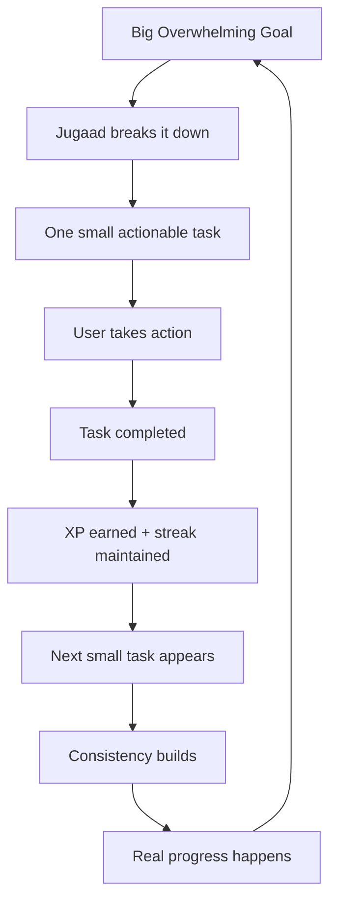
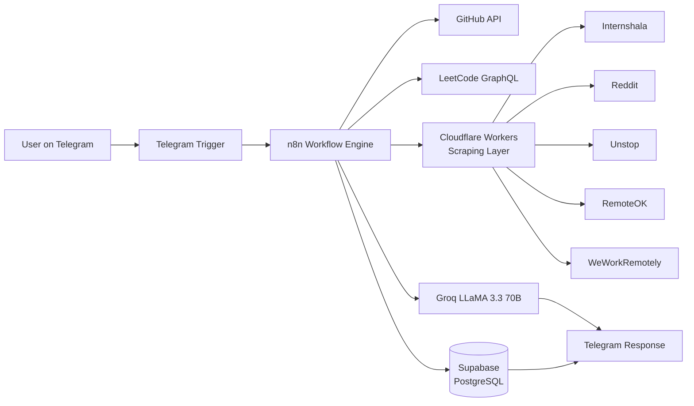
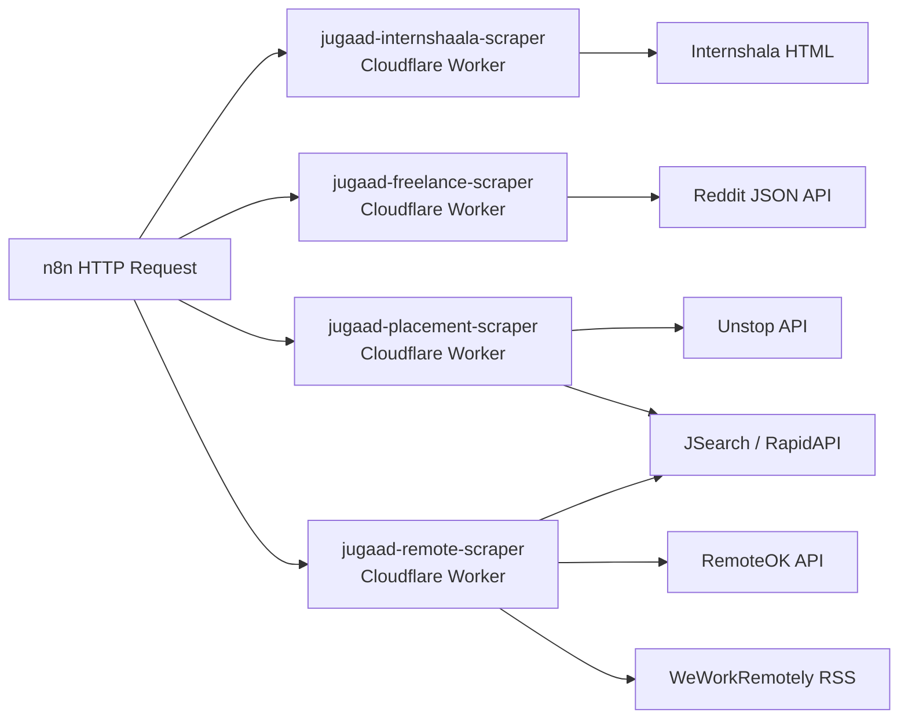
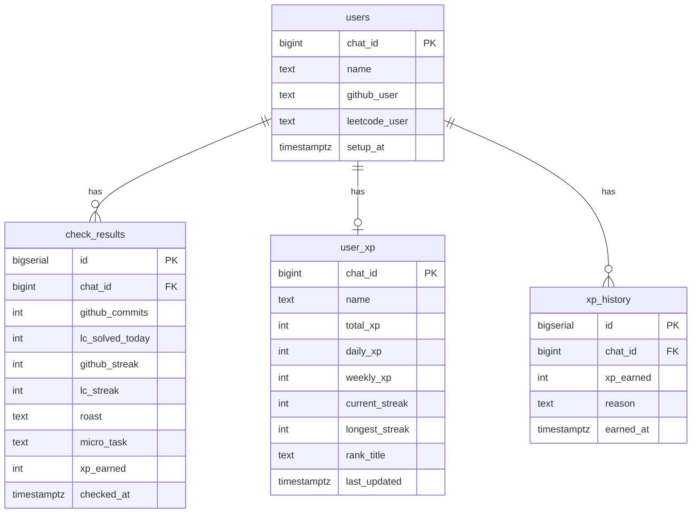

<p align="center">
  
</p>

<h1 align="center">Jugaad OS</h1>

<p align="center">
  <strong>Stop waiting. Start doing. One small step at a time.</strong>
</p>

<p align="center">
  
  
  
  
  
  
</p>

---

## What is Jugaad OS?

Jugaad OS is a **brutally honest, AI-powered productivity system** built for Indian college students and working professionals who know what they should be doing — but don't.

It runs entirely through **Telegram**, costs nothing to use, and works 24/7 without you having to open another app.

Every day it:
- Checks if you committed code or solved LeetCode problems
- Roasts you in Hinglish if you did nothing
- Sends you 45+ job opportunities every morning
- Tracks your XP and ranks you against other users
- Listens to your voice notes when you're anxious and responds with real comeback stories

The name **Jugaad** is deliberate. It means finding a simple, practical, creative solution to a problem. That's exactly what this is — a scrappy, effective system that meets you where you are.

---

## Why Jugaad OS?

### The Real Problem

Most productivity tools assume you're already motivated. They give you Kanban boards, habit trackers, and goal-setting frameworks.

But the actual problem is simpler and harder:

> You know what you should do. You just don't start.

"Prepare for placements" is too big. "Update my resume" feels overwhelming. "Learn DSA" sounds like a semester-long commitment.

So you open YouTube instead.

### The Jugaad Approach

Jugaad OS doesn't ask you to fix your entire life. It asks one question:

> **What's one useful thing you can do in the next 10 minutes?**

Instead of: *"Become placement ready"*
Jugaad says: *"Solve one easy LeetCode problem. Here's a good first issue on GitHub you can contribute to."*

Instead of: *"Build a project"*
Jugaad says: *"You haven't committed anything today. Your GitHub looks like a graveyard. Ek kaam kar — bas 10 minute."*

---

## The Jugaad Philosophy



Small tasks are not a compromise. They are the mechanism. Every big thing that has ever been built was built one small step at a time.

---

## Features

### Module 1 — Kal Kar Lunga Destructor 💀

The accountability engine. Your digital conscience.

| Feature | Description |
|---|---|
| `/setup` | Register your GitHub and LeetCode usernames |
| `/check` | Instantly check today's activity + receive a Hinglish roast |
| `/stats` | Full breakdown — commits, problems solved, streaks, global rank |
| `/start` | Welcome and onboarding |
| **Auto 10 PM check** | Every night the bot checks what you did and roasts you accordingly |
| **Micro-task finder** | Scrapes real "good first issue" GitHub problems for lazy days |
| **Groq LLaMA roasts** | Savage, personalised Hinglish commentary on your specific laziness |
| **Motivational stories** | Real comeback stories generated by LLM when you're struggling |

### Module 2 — Paisa Jugaad 💰

Every morning at 8 AM IST, 45+ fresh opportunities are scraped and sent to your Telegram.

| Source | What it scrapes |
|---|---|
| Internshala | Paid internships (₹5,000+/month filter) |
| Reddit r/forhire | Freelance gigs with budgets |
| Unstop + JSearch | Fresher placements from LinkedIn, Indeed, Glassdoor |
| RemoteOK + WeWorkRemotely + JSearch | Remote developer jobs worldwide |

### Module 3 — Anxiety to Action 🧠

Send a voice note or a text message when you're spiralling.

```
"Yaar nahi hoga mujhse, sab log aage nikal rahe hain"
         ↓
Whisper transcribes your voice (Hindi/Hinglish)
         ↓
Groq detects the anxiety pattern
         ↓
BeautifulSoup scrapes real Reddit comeback stories
         ↓
Bot responds with:
  1. Empathy message
  2. Real story of someone who was in your exact position
  3. One specific action to take RIGHT NOW
  4. A roast to snap you out of the spiral 😂
```

### Module 5 — Life XP Gamification 🎮

Turn your daily grind into a game.

| Action | XP Earned |
|---|---|
| GitHub commit | 30 XP per commit |
| LeetCode problem solved | 50 XP per problem |
| Active streak | 20 XP bonus per day |

**Rank System:**

| XP Range | Title |
|---|---|
| 0 – 99 | Naya Khiladi 🏏 |
| 100 – 299 | Gabbar ka Chamcha 😈 |
| 300 – 499 | Bumrah in Making 🎳 |
| 500 – 799 | Baazigar 🃏 |
| 800 – 1,199 | Virat Mode On 🔥 |
| 1,200 – 1,999 | Don ka Dost 👑 |
| 2,000 – 2,999 | Mogambo Khush Hua 😂 |
| 3,000+ | Don Hai Tu 🏆 |

Every Sunday at 8 AM IST, a full leaderboard with Groq-generated savage commentary is sent to all users.

---

## How It Works



---

## Technology Stack

| Layer | Technology |
|---|---|
| Bot Interface | Telegram Bot API |
| Workflow Engine | n8n (self-hosted) |
| LLM / AI | Groq LLaMA 3.3 70B, OpenAI Whisper |
| Scraping Layer | Cloudflare Workers (JavaScript + Regex) |
| Python Scraping | BeautifulSoup (n8n Python Code nodes) |
| Job Data API | JSearch via RapidAPI |
| Database | Supabase (PostgreSQL) |
| Scheduling | n8n Schedule Trigger + cron |
| Public Tunnel | ngrok (development) |
| Hosting | Railway / Render (production) |

---

## Architecture

### Workflows

| Workflow | Trigger | Purpose |
|---|---|---|
| Module 1 | Telegram message + 10 PM cron | Activity tracking + roasts |
| Module 2 | 8 AM IST daily | Job opportunity digest |
| Module 3 | Telegram voice/text | Anxiety to action converter |
| Module 5 | 10 PM daily + Sunday 8 AM | XP tracking + leaderboard |

### Scraping Architecture



---

## Database Schema

### Supabase Tables



### Supabase Functions

| Function | Purpose |
|---|---|
| `increment_xp(p_chat_id, p_daily_xp, p_name)` | Upserts XP, increments totals |
| `update_rank(p_chat_id)` | Recalculates rank title based on total XP |
| `reset_weekly_xp()` | Resets weekly XP every Sunday |

---

## Project Structure

```text
Jugaad OS/
├── n8n Workflows/
│   ├── Jugaad_OS_Module1.json       ← Activity tracking + commands
│   ├── Jugaad_OS_Module2.json       ← Daily job digest
│   ├── Jugaad_OS_Module3.json       ← Anxiety to action
│   └── Jugaad_OS_Module5.json       ← XP gamification
│
├── Cloudflare Workers/
│   ├── jugaad-internshaala-scraper.js
│   ├── jugaad-freelance-scraper.js
│   ├── jugaad-placement-scraper.js
│   └── jugaad-remote-scraper.js
│
└── Supabase/
    ├── schema.sql                    ← All table definitions
    └── functions.sql                 ← increment_xp, update_rank, reset_weekly_xp
```

---

## Prerequisites

- **Node.js** v18+ (for n8n)
- **n8n** installed globally via npm
- **ngrok** account (free tier) for webhook tunnelling
- **Telegram Bot** created via @BotFather
- **Supabase** project (free tier)
- **Groq API key** (free at console.groq.com)
- **Cloudflare account** (free tier, for Workers)
- **RapidAPI account** with JSearch subscribed (free BASIC plan)

---

## Installation

### 1. Clone the repository

```bash
git clone https://github.com/yours-anubhav/jugaad-os.git
cd jugaad-os
```

### 2. Install and start n8n

```bash
npm install -g n8n
```

### 3. Start ngrok (in a separate terminal)

```bash
ngrok http 5678
```

Copy the `https://xxxx.ngrok-free.app` URL.

### 4. Start n8n with the ngrok URL

**PowerShell:**
```powershell
$env:WEBHOOK_URL="https://xxxx.ngrok-free.app"; n8n start
```

**CMD:**
```cmd
set WEBHOOK_URL=https://xxxx.ngrok-free.app && n8n start
```

### 5. Set up Supabase

Run `supabase/schema.sql` and `supabase/functions.sql` in your Supabase SQL Editor.

### 6. Deploy Cloudflare Workers

For each worker in the `cloudflare-workers/` directory:
1. Go to Cloudflare Dashboard → Workers & Pages → Create Worker
2. Paste the worker code
3. Add your RapidAPI key where indicated
4. Deploy

### 7. Import n8n Workflows

In n8n → each workflow JSON file → import → add your credentials.

---

## Environment Variables

| Variable | Purpose | Where to get |
|---|---|---|
| `TELEGRAM_BOT_TOKEN` | Bot authentication | @BotFather on Telegram |
| `GROQ_API_KEY` | LLM + Whisper API | console.groq.com |
| `SUPABASE_URL` | Database connection | Supabase → Settings → API |
| `SUPABASE_SERVICE_KEY` | Full DB access | Supabase → Settings → API |
| `RAPIDAPI_KEY` | JSearch job data | rapidapi.com |
| `GITHUB_TOKEN` | Higher API rate limits | github.com/settings/tokens |
| `WEBHOOK_URL` | n8n public URL | ngrok output |

**Never commit real credentials to version control.**

---

## Bot Commands

| Command | Description |
|---|---|
| `/start` | Welcome message and onboarding |
| `/setup github_username leetcode_username` | Register your profiles |
| `/check` | Check today's activity + get roasted 😂 |
| `/stats` | Full stats breakdown + Groq vibe assessment |

**Voice notes and text messages** are also supported for Module 3.

---

## Scheduled Automations

| Time | What happens |
|---|---|
| 8:00 AM IST | Module 2 — 45+ job opportunities sent to all users |
| 10:00 PM IST | Module 1 — Activity check + roast for all users |
| 10:00 PM IST | Module 5 — XP update sent to all users |
| Sunday 8:00 AM IST | Module 5 — Weekly leaderboard + Groq commentary |

---

## Real-World Use Cases

### The Procrastinator

> "I'll start tomorrow."

Jugaad checks at 10 PM every night. If you did nothing, it finds a GitHub issue you can fix in 10 minutes and sends it with a roast. Tomorrow never comes, but 10 minutes right now always can.

### The Placement Aspirant

> "I should prepare for placements but don't know where to start."

Every morning at 8 AM, fresh internships and fresher jobs from Internshala, LinkedIn, Unstop, and Indeed arrive in your Telegram. No job board browsing required.

### The Anxious Student

> "Everyone is getting offers. I'm falling behind."

Send a voice note. Jugaad transcribes it, understands the anxiety, finds a real Reddit story of someone who was in your exact position and came out fine, and gives you one thing to do right now.

### The Competitive Type

> "I want to be better than my friends."

Module 5 tracks XP across all users. Every Sunday, a leaderboard with Bollywood/cricket titles is sent to everyone. Nobody wants to be "Gabbar ka Chamcha" for another week.

---

## Deployment

### n8n on Railway (recommended for production)

```bash
npm install -g @railway/cli
railway login
railway init
railway up
```

Set `WEBHOOK_URL` to your Railway deployment URL and re-activate all workflows.

### Cloudflare Workers

Workers are deployed directly through the Cloudflare dashboard or via Wrangler CLI. They run on Cloudflare's global edge network — always on, zero cold starts, free for 100,000 requests/day.

---

## Troubleshooting

| Issue | Solution |
|---|---|
| Telegram webhook fails | Ensure ngrok is running and `WEBHOOK_URL` is set correctly |
| GitHub returns empty array | Account may have no public events; enable "Always Output Data" in n8n HTTP Request settings |
| LeetCode "user does not exist" | Username is case-sensitive; verify exact username from profile URL |
| Supabase duplicate key error | User already exists; the `/setup` command handles upsert automatically |
| n8n attribution showing in messages | Set `Append n8n Attribution: false` in every Telegram node's Additional Fields |
| Cron fires at wrong time | n8n uses server timezone; calculate UTC offset manually (IST = UTC+5:30) |
| Cloudflare Worker returns empty | Site structure may have changed; check the debug endpoint and update regex selectors |

---

## Roadmap

### ✅ Completed

- Telegram bot with `/setup`, `/check`, `/stats`, `/start` commands
- GitHub activity scraping via REST API
- LeetCode activity scraping via GraphQL
- Groq LLaMA 3.3 70B roast generation in Hinglish
- Internshala internship scraper (Cloudflare Worker)
- Reddit r/forhire freelance gig scraper
- Unstop + JSearch placement scraper
- RemoteOK + WeWorkRemotely remote job scraper
- Daily 8 AM job digest automation
- Nightly 10 PM activity check automation
- Supabase database integration
- Voice note transcription via Whisper
- BeautifulSoup Reddit scraping (Python Code node)
- XP gamification system
- Rank titles (Bollywood + Cricket)
- Weekly leaderboard with Groq commentary
- Weekly XP reset

### 🔮 Planned

- Module 4 — Clout Farm (auto LinkedIn/Twitter content generation)
- Push notifications for streak milestones
- Friend groups and private leaderboards
- Resume gap analyzer (compare your profile to scraped JDs)
- Interview question scraper from Glassdoor
- UPSC/competitive exam preparation track
- Multi-language support (Tamil, Telugu, Bengali)
- Web dashboard for stats visualization

---

## Contributing

```text
Fork the repository
       ↓
Create a feature branch
  git checkout -b feature/your-feature-name
       ↓
Make your changes
       ↓
Test locally with n8n
       ↓
Commit with a clear message
  git commit -m "feat: add xyz feature"
       ↓
Push to your fork
  git push origin feature/your-feature-name
       ↓
Open a Pull Request
```

Contributions welcome for:
- New Cloudflare Workers (new job sources)
- Better Hinglish roast prompts
- Additional platform scrapers
- Bug fixes and stability improvements

---

## Project Philosophy

Most people aren't lazy. They're overwhelmed.

The gap between "I know what I should do" and "I am doing it" is not a motivation problem. It is a starting problem. The first step feels too big, so you take no step at all.

Jugaad OS doesn't fix you. It just makes the first step smaller.

One commit. One problem. One application. One voice note.

That's enough for today. Tomorrow, one more.

---

## License

MIT License — free to use, modify, and distribute.

---

## Author

**Anubhav Kumar Srivastava**
B.Tech Computer Science, GLA University, Mathura

- GitHub: [yours-anubhav](https://github.com/yours-anubhav)
- LeetCode: [Anubhav03042004](https://leetcode.com/u/Anubhav03042004/)
- LinkedIn: [anubhav-kumar-srivastava](https://linkedin.com/in/anubhav-kumar-srivastava-abb28b239)

---

<p align="center">
  
</p>
